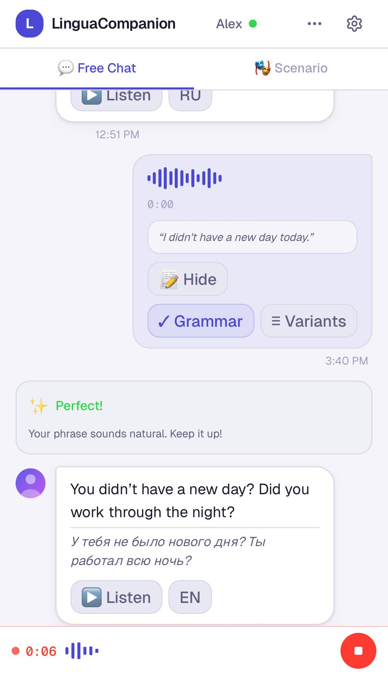
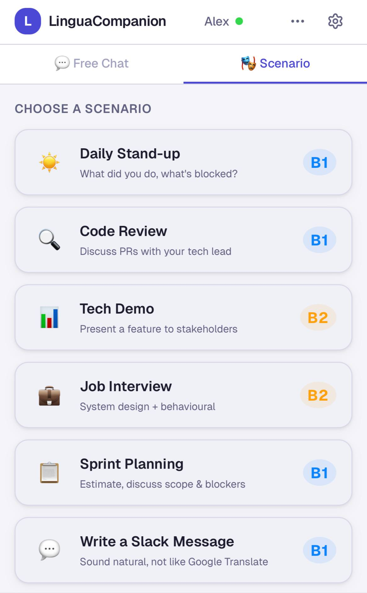
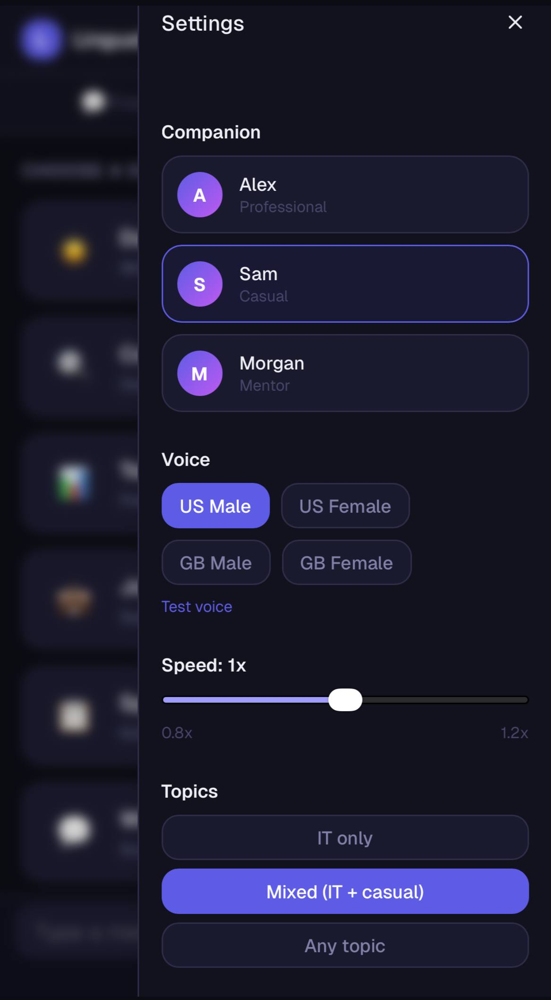
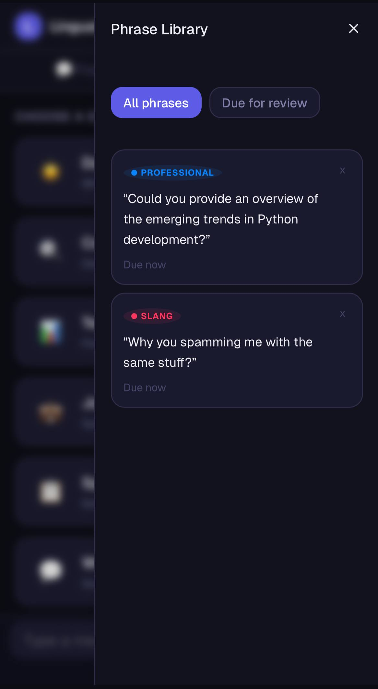
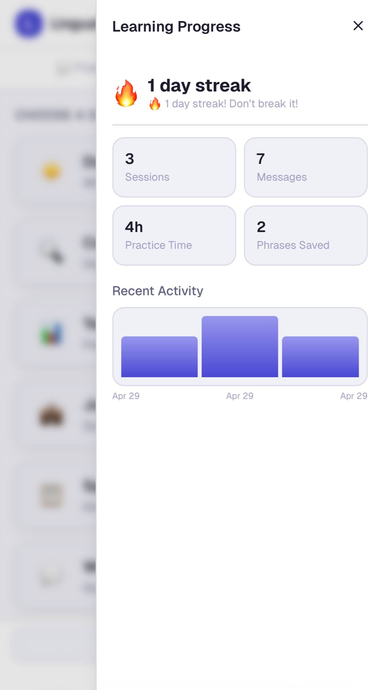
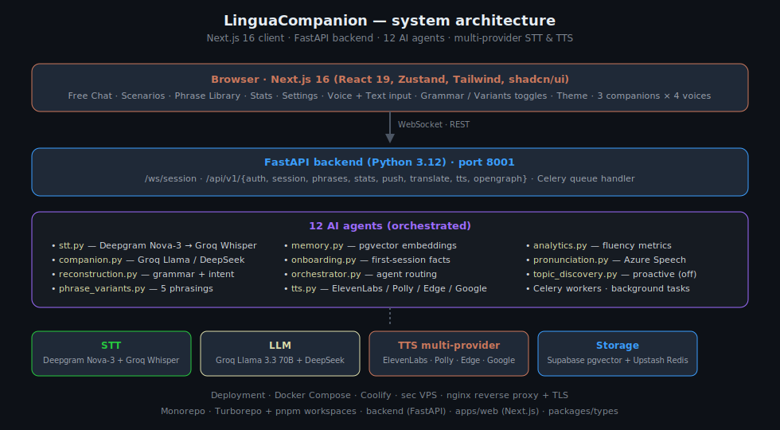

# LinguaCompanion

[](LICENSE)
[](https://github.com/CreatmanCEO/lingua-companion/stargazers)
[](https://github.com/CreatmanCEO/lingua-companion/actions/workflows/validate.yml)
[](#статус)
[](#статус)
[](https://nextjs.org)
[](https://fastapi.tiangolo.com)

🇷🇺 Русский · [🇬🇧 English](README.md)

**Voice-first AI-компаньон для изучения английского для русскоговорящих IT-специалистов — нативная поддержка code-switching RU/EN, conversational memory, scenario-based практика и phrase library со спейсд-репетишн.**

```
"Yesterday я работал над automation pipeline"
                    ↓
"Yesterday I worked on an automation pipeline."
```

## Статус

**Активная разработка. Публичный демо-доступ пока не открыт.**

Продукт работает и live-тестируется — за апрель 2026 пройдено 9 сессий разработки. **91 backend-тест проходит · E2E Playwright 10/11 · ElevenLabs TTS подтверждён в продакшне.** URL деплоя сознательно не указан в README — проект в активной итерации, и автор не хочет, чтобы анонимный трафик жёг продакшн-бюджеты на API. Публичный доступ откроется после стабилизации workflow.

Если оцениваете эту работу для роли / партнёрства / коллаборации: открой issue или свяжись через [@CreatmanCEO](https://github.com/CreatmanCEO) — приватное демо организуется.

## Как это выглядит

<table>
  <tr>
    <td align="center"></td>
    <td align="center"></td>
  </tr>
  <tr>
    <td align="center"><b>Free Chat с переключателями Grammar / Variants</b><br><sub>Голос или текст на входе. Компаньон отвечает билингвально. Per-message реконструкция (✓ Grammar) и 5 вариантов формулировок (≡ Variants) по клику.</sub></td>
    <td align="center"><b>Scenario-практика</b><br><sub>IT-специфичные ролевые игры на B1 / B2: stand-up, code review, tech demo, system design interview, sprint planning, написание Slack-сообщения.</sub></td>
  </tr>
  <tr>
    <td align="center"></td>
    <td align="center"></td>
  </tr>
  <tr>
    <td align="center"><b>Три компаньона, четыре голоса</b><br><sub>Alex (professional), Sam (casual), Morgan (mentor). US / GB варианты голоса. Скорость 0.8×–1.2×. Фильтры тем и CEFR-уровня.</sub></td>
    <td align="center"><b>Phrase Library со спейсд-репетишн</b><br><sub>Сохранённые фразы с тегами Professional / Slang. Очередь Due-now / Due-for-review. Кнопки Forgot / Hard / Easy ведут SRS-расписание.</sub></td>
  </tr>
  <tr>
    <td align="center"></td>
    <td>&nbsp;</td>
  </tr>
  <tr>
    <td align="center"><b>Learning progress</b><br><sub>Streak-трекинг, счётчик сессий, время практики, сохранённые фразы. Бар-чарт recent activity для retention-петли.</sub></td>
    <td>&nbsp;</td>
  </tr>
</table>

## Зачем это существует

Существующие language-app оптимизируют под vocabulary-дрилы, gamified streaks или generic-разговорную практику. Ни одно не сделано под **то, как русскоговорящий IT-специалист реально хочет говорить по-английски** — со спонтанным code-switching, IT-вокабуляром как lingua franca, и целью «звучать как коллега на стендапе», а не «сдать A2-экзамен».

LinguaCompanion построен под этого пользователя. Компаньон принимает смешанную RU/EN речь, реконструирует intent в естественный английский, возвращает билингвальный ответ с click-to-listen TTS, и по запросу даёт grammar correction или 5 вариантов фразировки. Scenario-режим запускает ролевые игры под daily stand-up, code review, tech demo, system design interview, sprint planning и Slack-писание — каждый с CEFR-тегом B1 или B2.

## Архитектура



| Слой | Технология | Заметки |
|---|---|---|
| Frontend | Next.js 16 (App Router), React 19, Zustand 5, Tailwind, shadcn/ui | port 3001 — messenger-style UI |
| Backend | Python 3.12, FastAPI, WebSocket, Celery + Redis | port 8001 — `/ws/session` + `/api/v1/*` |
| **STT основной** | **Deepgram Nova-3** (`language=multi`) | code-switching подтверждён: 6/6 spike-тестов |
| STT fallback | Groq Whisper large-v3-turbo | sub-секундная latency, авто-переключение при сбое Deepgram |
| LLM main | Groq Llama 3.3 70B через LiteLLM | hot-swap через `LLM_MODEL` env |
| LLM onboarding | DeepSeek (OpenRouter) | заменил rate-limited Gemma в коммите `adbbcbf` |
| **TTS production** | **ElevenLabs** (подтверждено: 40 КБ аудио на ответ) | три голоса компаньонов: Alex, Sam, Morgan |
| TTS fallbacks | AWS Polly · Edge-TTS · Google Neural2 | Polly сейчас заблокирован IAM; Edge-TTS заблокирован с VPS IP |
| База данных | Supabase (PostgreSQL + pgvector) | conversational memory + phrase library |
| Cache / queue | Upstash Redis (TLS) | Celery broker + per-session кэш |
| Embeddings | Google Embeddings API | экономит ~800 МБ RAM vs локальные sentence-transformers |
| Произношение | Azure Speech SDK | phoneme-level scoring |
| Monorepo | Turborepo + pnpm workspaces | `apps/web`, `backend/`, `packages/types`, `infra/docker` |
| Деплой | Docker Compose · Coolify · nginx | sec VPS, TLS, reverse proxy |

Для диаграмм и WebSocket / agent flow см. [`docs/ARCHITECTURE.md`](docs/ARCHITECTURE.md).

## Что построено (реальная поверхность, не roadmap)

### Frontend (`apps/web/src/components/`, 15 компонентов)

- `CompanionBubble`, `UserBubble` — рендер сообщений с билингвальной поддержкой
- `VoiceBar` — push-to-talk + индикатор записи
- `ReconstructionBlock` — grammar correction с diff-подсветкой
- `VariantCards` — 5 альтернативных фразировок по запросу
- `LoginScreen` — Google OAuth + email/password
- `SettingsPanel` — 3 компаньона × 4 голоса × скорость × тема × CEFR-уровень × theme
- `PhraseLibrary` — сохранённые фразы со spaced-repetition очередью (Forgot / Hard / Easy)
- `StatsScreen` — streaks, sessions, messages, practice time, recent-activity chart
- `SessionSummary`, `HintOverlay`, `ThemeToggle`, плюс `ui/` и `layout/`

### Backend (`backend/app/`, 12 агентов + 9 routes)

- **Агенты:** `stt`, `companion`, `memory`, `onboarding`, `orchestrator`, `phrase_variants`, `pronunciation`, `reconstruction`, `topic_discovery`, `tts`, `analytics`, плюс `prompts/`
- **Routes:** `auth`, `opengraph`, `phrases`, `push`, `session`, `stats`, `translate`, `tts`, `ws` (WebSocket)
- **Migrations:** Alembic
- **Tests:** 91 backend pytest проходит · E2E Playwright 10/11

## Структура проекта

```
lingua-companion/
├── apps/
│   └── web/              # Next.js 16 web client
├── backend/              # FastAPI + Celery + 12 агентов
│   ├── app/agents/       # stt · companion · memory · reconstruction · …
│   ├── app/api/routes/   # auth · session · phrases · stats · ws · …
│   ├── app/prompts/      # шаблоны промптов
│   ├── migrations/       # Alembic
│   └── tests/            # pytest
├── packages/
│   └── types/            # shared TypeScript types
├── infra/
│   └── docker/           # Docker Compose configs
├── docs/
│   ├── ARCHITECTURE.md       # системная архитектура + диаграммы
│   ├── AI_PIPELINE.md        # детали agent flow
│   ├── API_KEYS.md           # требуемые env vars + сетап
│   ├── BACKLOG.md            # текущие приоритеты
│   ├── COMPETITIVE_ANALYSIS.md
│   ├── DESIGN_JOURNEY.md
│   ├── VPS_SETUP.md          # runbook деплоя
│   ├── architecture.svg      # hero-диаграмма этого README
│   └── screenshots/          # ассеты README
├── plans/                # per-iteration design-документы
├── tests/
│   └── e2e/              # Playwright specs
├── CHANGELOG.md
├── CLAUDE.md
├── Makefile
└── README.md
```

## Работа над проектом

Проект сконфигурирован под [Claude Code](https://code.claude.com) как primary драйвер разработки. См. [`CLAUDE.md`](CLAUDE.md) — конституция проекта (стек, команды, CRITICAL RULES, инвентарь агентов). Тот же автор поддерживает [Claude Code Anti-Regression Setup](https://github.com/CreatmanCEO/claude-code-antiregression-setup) — паттерн `.claude/` config + хуки + субагенты, который и держит 91-тестовый suite зелёным во время рефакторингов.

```bash
# Bootstrap (предполагает pnpm + Python 3.12 + Postgres локально или через .env)
pnpm install
cd backend && pip install -r requirements.txt && cd ..

# Frontend dev-сервер (порт 3001)
pnpm --filter @lingua/web dev

# Backend (порт 8001)
cd backend && uvicorn app.main:app --reload --port 8001

# Тесты
cd backend && pytest                          # 91 backend-тест
pnpm --filter @lingua/web test               # frontend unit-тесты (Vitest)
pnpm --filter @lingua/web exec playwright test # E2E
```

Полная история per-session работы и багов — в [CHANGELOG.md](CHANGELOG.md).

## Ограничения

Это персональный продукт в активной разработке. Честные ограничения:

- **Публичный URL деплоя в этом README не опубликован.** Продукт работает на персональном VPS с метерированными API-бюджетами. Анонимный трафик напрямую жёг бы Anthropic / Groq / Deepgram / ElevenLabs spend автора во время итераций. Публичный доступ откроется когда workflow стабилизируется.
- **Topic Discovery сейчас отключен.** Ранние итерации проактивно подбрасывали "Hey, saw this and thought of you…" из HN / Reddit. В тестировании это вырождалось в повторяющийся Rust-spam — отключено в коммите `5546803`. Вернётся как Rich Link Cards в будущих итерациях.
- **TTS-провайдеры частично живые.** ElevenLabs подтверждён в продакшне (40 КБ аудио на ответ). AWS Polly падает с `AccessDeniedException` (нужен IAM-fix). Edge-TTS заблокирован с VPS IP по 403 от Microsoft. Google Neural2 — рабочий бюджетный fallback.
- **Pronunciation analysis встроен, но в UI не выведен.** Azure Speech SDK интеграция есть на agent-уровне; per-phoneme scoring в `CompanionBubble` — pending.
- **Free Chat сессии могут стопориться при быстром send.** `tests/UX-Test-Report.md` помечает P3: отправка нескольких сообщений в течение ~200 мс отбрасывает все кроме первого. Митигация: WebSocket message queue с debounced flush — в backlog'е.
- **A2 / B2 фиксируется тогглом уровня.** Компаньон не определяет уровень пользователя автоматически по ходу сессии — ставится в Settings и применяется к последующим turn'ам. Адаптивная сложность — на roadmap'е.

## Связанные проекты

- [Claude Code Anti-Regression Setup](https://github.com/CreatmanCEO/claude-code-antiregression-setup) — sister-репо того же автора. `.claude/` config + субагенты, которые держат 91-тестовый suite зелёным.
- [ai-context-hierarchy](https://github.com/CreatmanCEO/ai-context-hierarchy) — sister-репо. Иерархия Level 0 / Level 1, которой Claude Code пользуется на этом проекте чтобы навигировать между `apps/web`, `backend` и `packages` без перечитывания всего дерева.
- [claude-statusline](https://github.com/CreatmanCEO/claude-statusline) — sister-репо. Statusline, показывающий context %, модель, cost и VPS, на котором крутится этот продукт во время dev-сессий.
- [notebooklm-claude-workflows](https://github.com/CreatmanCEO/notebooklm-claude-workflows) — sister-репо. Используется research-workflow этого проекта при подборе design-референсов и competitive-analysis.

## Автор

**Николай Подоляк (Nick Podolyak)** — Python-разработчик и цифровой архитектор в [CREATMAN](https://creatman.site)

- GitHub: [@CreatmanCEO](https://github.com/CreatmanCEO)
- Habr: [creatman](https://habr.com/ru/users/creatman/)
- dev.to: [@creatman](https://dev.to/creatman)

## Лицензия

[MIT](LICENSE) · Николай Подоляк
